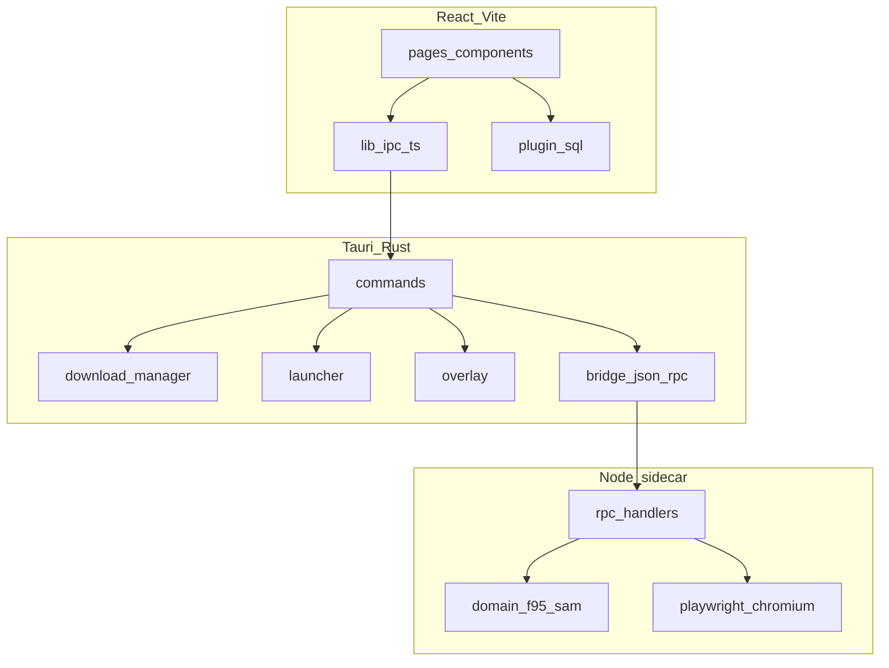

# F95 App

**Sprachen:** [English](README.md) · [Português (BR)](README.pt-BR.md) · Deutsch · [Русский](README.ru.md)

Desktop-Client für [F95Zone](https://f95zone.to/). SAM-Katalog durchsuchen, lokale Bibliothek verwalten, von mehreren File-Hostern herunterladen, Spiele starten und bei Netzwerkausfall offline weiterarbeiten.

Repository: [github.com/rares478/f95-app](https://github.com/rares478/f95-app)

<!-- Screenshots vor dem Release ergänzen -->

---

## Was die App macht

F95 App packt F95Zone in eine Tauri-Hülle mit einem Layout, das eher einem Game-Launcher als einem Browser-Tab ähnelt. Einmal anmelden, Threads über SAM suchen und filtern, Downloads in selbst gewählte Installationsbibliotheken einreihen und Spielzeit pro Titel tracken.

Das Backend verteilt die Arbeit auf Rust (Downloads, Launcher, Overlay) und einen Node.js-Sidecar (F95-HTTP + Playwright für Seiten, die einfache Requests blockieren).

---

## Funktionen

- **Authentifizierung** — eigenes Login-Fenster, optionales Remember-me über Stronghold-Vault
- **Store** — SAM-Katalog mit Prefix-/Tag-Filtern, Suche, Sortierung, Paginierung
- **Bibliothek** — installierte Titel, Versionsverfolgung, Spielzeit, mehrere Installationsordner
- **Downloads** — Warteschlange mit Live-Fortschritt, Auto-Entpacken (zip/7z/rar), Save-Migration
- **File-Hoster** — GoFile, MEGA, UploadHaven, BuzzHeavier, Datanodes, MixDrop, Google Drive, WorkUpload, MediaFire, Pixeldrain
- **Captcha** — interaktiver MixDrop-Flow in einem dedizierten Webview-Fenster
- **Social** — Following-Liste, F95-Alerts, RSS-Feed für Bibliotheks-Updates
- **Offline** — gecachtes Profil und lokale Bibliothek ohne Verbindung
- **Overlay** — experimentelles In-Game-Overlay unter Windows (Notizen, Guides, Hotkey)
- **i18n** — Portugiesisch, Englisch, Deutsch, Russisch

---

## Architektur

Drei Schichten: React-Frontend → Tauri/Rust → Node-Sidecar.



Vollständige Beschreibung: [docs/ARCHITECTURE.de.md](docs/ARCHITECTURE.de.md)

---

## Projektstruktur

```
f95-app/
├── src/                      # React-Frontend
│   ├── pages/                # Routen-Views (Store, Bibliothek, Downloads, …)
│   ├── components/           # UI-Bausteine
│   ├── contexts/             # React-State-Provider
│   ├── lib/                  # IPC-Bridge, DB, Settings, i18n, Theme
│   ├── locales/              # Übersetzungsstrings (pt, en, de, ru)
│   └── styles/               # CSS-Module
├── src-tauri/                # Rust-Backend
│   ├── src/
│   │   ├── commands/         # Tauri-invoke-Handler
│   │   ├── download/         # Download-Manager + Host-Resolver
│   │   ├── bridge.rs         # JSON-RPC zum Sidecar
│   │   ├── launcher.rs       # Spielprozess-Verwaltung
│   │   └── overlay*.rs       # In-Game-Overlay (Windows)
│   ├── sidecar/              # Node.js f95-bridge-Prozess
│   │   └── src/
│   │       ├── rpc/handlers/ # Auth, SAM, Resolver
│   │       └── domain/       # F95-, SAM-, Game-Parser
│   └── tauri.conf.json
├── docs/                     # Technische Dokumentation
└── scripts/                  # Build-Helfer (Installer-Bitmaps, CSS-Tools)
```

---

## Voraussetzungen

| Tool | Version |
|------|---------|
| Node.js | 20+ |
| Rust | stable via [rustup](https://rustup.rs/) |
| Tauri CLI | `@tauri-apps/cli` v2 (in devDependencies) |
| Windows | WebView2 Runtime, MSVC Build Tools (Overlay + native Deps) |

macOS und Linux können die Hülle kompilieren; Overlay und plattformspezifische Features sind Windows-only.

---

## Erste Schritte

```bash
git clone https://github.com/rares478/f95-app.git
cd f95-app
npm install
npm --prefix src-tauri/sidecar install
npm run tauri dev
```

Nach Änderungen am Sidecar-TypeScript vor dem Testen neu bauen:

```bash
npm --prefix src-tauri/sidecar run build
```

### `browser-rest-api`-Abhängigkeit

Sidecar und Frontend teilen ein HTTP-Client-Paket. Zwei Setups:

**Lokale Entwicklung** — `browser-api` neben `f95-app` klonen, damit der Pfad `../../../browser-api` von `src-tauri/sidecar/` aufgelöst wird. Das Sidecar-`package.json` nutzt `file:../../../browser-api`.

**npm / Release** — Root-`package.json` holt `browser-rest-api@^1.0.0` aus dem Registry. Sidecar für Release-Builds auf dieselbe veröffentlichte Version ausrichten.

---

## Build

```bash
npm run tauri build
```

Release-Pipeline (aus `tauri.conf.json`):

1. Frontend-Build → `dist/`
2. Sidecar-TypeScript-Kompilierung
3. esbuild-Bundle → `bundle.cjs`
4. Node-SEA-Packaging + Playwright Chromium
5. Unnötige Playwright-Artefakte entfernen
6. NSIS/WiX-Installer (Windows)

Installer-Assets: `npm run installer:assets` (PowerShell, nur Windows).

Sidecar-Build-Details: [src-tauri/sidecar/README.md](src-tauri/sidecar/README.md)

---

## Konfiguration

Keine `.env`-Datei. Credentials und Einstellungen werden in der App-UI gesetzt und lokal gespeichert:

| Speicher | Inhalt |
|----------|--------|
| SQLite `f95app.db` | Bibliothek, Downloads, Settings, Benachrichtigungen |
| Stronghold `vault.hold` | Remember-me-Passwort, MEGA/UploadHaven-Sessions |
| `sessions/` | F95-Cookie-Jars (ein Ordner pro Session) |
| Tabelle `app_settings` | GoFile-Token, MixDrop-API-Keys, Datanodes-Key, etc. |

Standard-Downloadordner: `<app_local_data_dir>/downloads/`.

---

## Unterstützte Plattformen

| Plattform | Support |
|-----------|---------|
| Windows | Voll — Downloads, Launcher, Overlay, Shortcuts |
| macOS | Teilweise — kein Overlay, eingeschränkte Host-Tests |
| Linux | Teilweise — gleiche Einschränkungen wie macOS |

---

## Mitwirken

Siehe [CONTRIBUTING.de.md](CONTRIBUTING.de.md) für Branch-Namen, Commit-Format und PR-Checkliste.

---

## Unterstützung

F95 App ist ein Nebenprojekt. Wenn es dir Zeit spart, hilft ein Kaffee bei der Weiterentwicklung:

[](https://ko-fi.com/Z8R020T4GC)

---

## Lizenz

Copyright (c) 2026 rares478 / F95 App

Veröffentlicht unter der [GNU General Public License v3.0 oder später](LICENSE).
