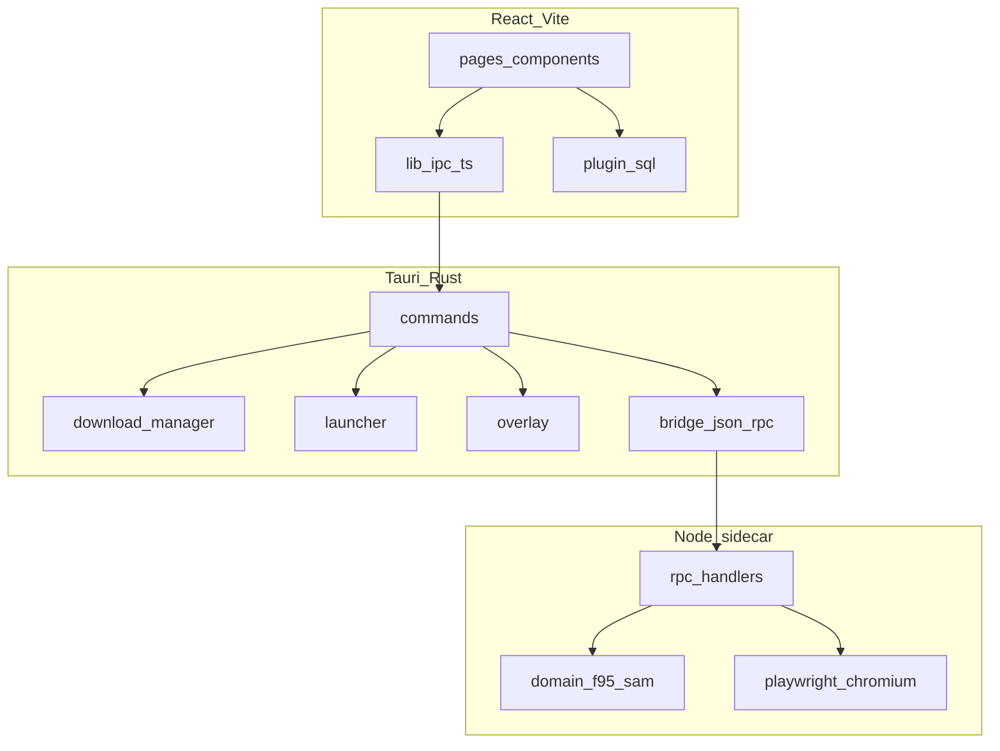

# F95 App

**Languages:** English · [Português (BR)](README.pt-BR.md) · [Deutsch](README.de.md) · [Русский](README.ru.md)

Desktop client for [F95Zone](https://f95zone.to/). Browse the SAM catalog, manage a local library, download from multiple file hosts, launch games, and work offline when the network drops.

Repository: [github.com/jky-sh/f95-app](https://github.com/jky-sh/f95-app)

<!-- add screenshots before release -->

---

## What it does

F95 App wraps F95Zone in a Tauri shell with a layout closer to a game launcher than a browser tab. You log in once, search and filter threads through SAM, queue downloads to install libraries you pick, and track playtime per title.

The backend splits work across Rust (downloads, launcher, overlay) and a Node.js sidecar (F95 HTTP + Playwright for pages that block plain requests).

---

## Features

- **Authentication** — dedicated login window, optional remember-me via Stronghold vault
- **Store** — SAM catalog with prefix/tag filters, search, sorting, pagination
- **Library** — installed titles, version tracking, playtime, multiple install folders
- **Downloads** — queued transfers with live progress, auto-extract (zip/7z/rar), save migration
- **File hosts** — GoFile, MEGA, UploadHaven, BuzzHeavier, Datanodes, MixDrop, Google Drive, WorkUpload, MediaFire, Pixeldrain
- **Captcha** — interactive MixDrop flow through a dedicated webview window
- **Social** — following list, F95 alerts, RSS feed for library updates
- **Offline** — cached profile and local library when disconnected
- **Overlay** — experimental in-game overlay on Windows (notes, guides, hotkey toggle)
- **i18n** — Portuguese, English, German, Russian

---

## Architecture

Three layers: React frontend → Tauri/Rust → Node sidecar.



Full breakdown: [docs/ARCHITECTURE.md](docs/ARCHITECTURE.md)

---

## Project structure

```
f95-app/
├── src/                      # React frontend
│   ├── pages/                # Route-level views (store, library, downloads, …)
│   ├── components/           # UI building blocks
│   ├── contexts/             # React state providers
│   ├── lib/                  # IPC bridge, db, settings, i18n, theme
│   ├── locales/              # Translation strings (pt, en, de, ru)
│   └── styles/               # CSS modules
├── src-tauri/                # Rust backend
│   ├── src/
│   │   ├── commands/         # Tauri invoke handlers
│   │   ├── download/         # Download manager + host resolvers
│   │   ├── bridge.rs         # JSON-RPC to sidecar
│   │   ├── launcher.rs       # Game process management
│   │   └── overlay*.rs       # In-game overlay (Windows)
│   ├── sidecar/              # Node.js f95-bridge process
│   │   └── src/
│   │       ├── rpc/handlers/ # Auth, SAM, resolvers
│   │       └── domain/       # F95, SAM, game parsers
│   └── tauri.conf.json
├── docs/                     # Technical documentation
└── scripts/                  # Build helpers (installer bitmaps, CSS tools)
```

---

## Requirements

| Tool | Version |
|------|---------|
| Node.js | 20+ |
| Rust | stable via [rustup](https://rustup.rs/) |
| Tauri CLI | `@tauri-apps/cli` v2 (installed with devDependencies) |
| Windows | WebView2 Runtime, MSVC build tools (for overlay + native deps) |

macOS and Linux can compile the shell, but overlay and some platform-specific features are Windows-only.

---

## Getting started

```bash
git clone https://github.com/jky-sh/f95-app.git
cd f95-app
npm install
npm --prefix src-tauri/sidecar install
npm run tauri dev
```

After editing sidecar TypeScript, rebuild it before testing:

```bash
npm --prefix src-tauri/sidecar run build
```

### `browser-rest-api` dependency

The sidecar and frontend share an HTTP client package. Two setups:

**Local development** — clone `browser-api` next to `f95-app` so the path `../../../browser-api` resolves from `src-tauri/sidecar/`. The sidecar `package.json` uses `file:../../../browser-api`.

**npm / release** — root `package.json` pulls `browser-rest-api@^1.0.0` from the registry. Point the sidecar to the same published version for release builds.

---

## Build

```bash
npm run tauri build
```

Release pipeline (from `tauri.conf.json`):

1. Frontend build → `dist/`
2. Sidecar TypeScript compile
3. esbuild bundle → `bundle.cjs`
4. Node SEA packaging + Playwright Chromium
5. Prune unused Playwright artifacts
6. NSIS/WiX installer (Windows)

Installer assets: `npm run installer:assets` (PowerShell, Windows only).

Sidecar build details: [src-tauri/sidecar/README.md](src-tauri/sidecar/README.md)

---

## Configuration

No `.env` file. Credentials and preferences are set in the app UI and stored locally:

| Storage | Contents |
|---------|----------|
| SQLite `f95app.db` | Library, downloads, settings, notifications |
| Stronghold `vault.hold` | Remember-me password, MEGA/UploadHaven sessions |
| `sessions/` | F95 cookie jars (one folder per session) |
| `app_settings` table | GoFile token, MixDrop API keys, Datanodes key, etc. |

Default download folder: `<app_local_data_dir>/downloads/`.

---

## Supported platforms

| Platform | Support |
|----------|---------|
| Windows | Full — downloads, launcher, overlay, shortcuts |
| macOS | Partial — no overlay, limited host testing |
| Linux | Partial — same caveats as macOS |

---

## Contributing

See [CONTRIBUTING.md](CONTRIBUTING.md) for branch naming, commit format, and PR checklist.

---

## Support

F95 App is a side project. If it saves you time, a coffee helps keep development going:

[](https://ko-fi.com/Z8R020T4GC)

---

## License

Copyright (c) 2026 jky-sh / F95 App

Released under the [GNU General Public License v3.0 or later](LICENSE).
