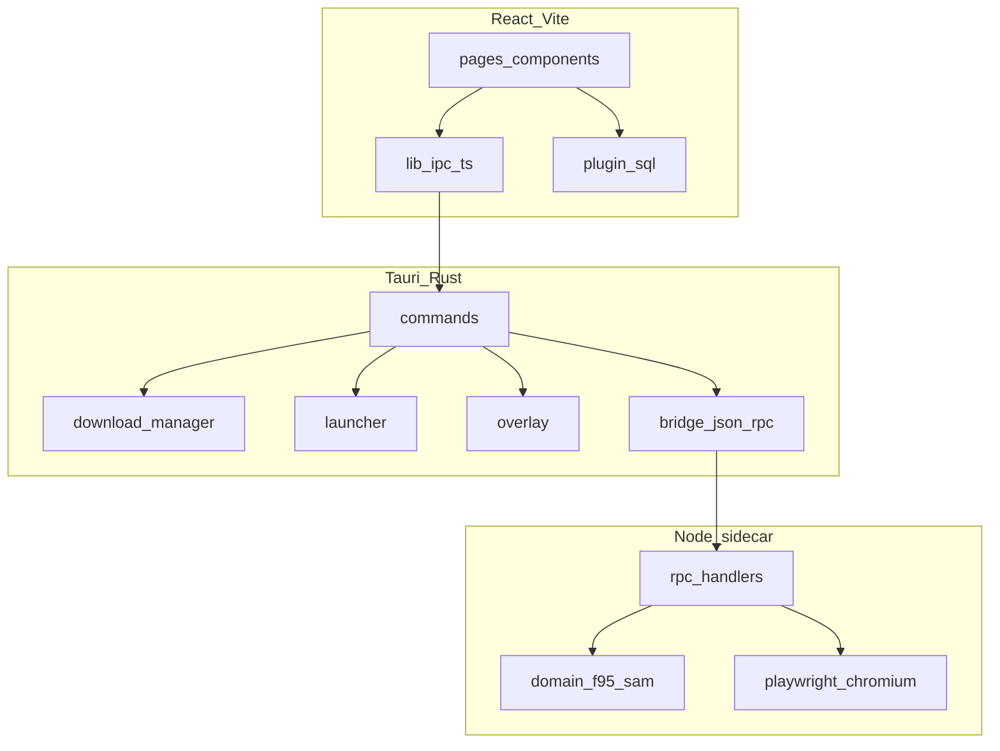

# F95 App

**Idiomas:** [English](README.md) · Português (BR) · [Deutsch](README.de.md) · [Русский](README.ru.md)

Cliente desktop para o [F95Zone](https://f95zone.to/). Navegue pelo catálogo SAM, gerencie uma biblioteca local, baixe de vários hosts de arquivo, lance jogos e continue usando o app offline quando a rede cair.

Repositório: [github.com/rares478/f95-app](https://github.com/rares478/f95-app)

<!-- adicionar screenshots antes do release -->

---

## O que faz

O F95 App envolve o F95Zone em um shell Tauri com layout mais próximo de um launcher de jogos do que de uma aba de navegador. Você faz login uma vez, busca e filtra threads pelo SAM, enfileira downloads para bibliotecas de instalação que você escolhe e acompanha o tempo de jogo por título.

O backend divide o trabalho entre Rust (downloads, launcher, overlay) e um sidecar Node.js (HTTP do F95 + Playwright para páginas que bloqueiam requisições simples).

---

## Funcionalidades

- **Autenticação** — janela de login dedicada, remember-me opcional via vault Stronghold
- **Loja** — catálogo SAM com filtros de prefixo/tag, busca, ordenação, paginação
- **Biblioteca** — títulos instalados, controle de versão, playtime, múltiplas pastas de instalação
- **Downloads** — fila com progresso em tempo real, auto-extração (zip/7z/rar), migração de saves
- **Hosts de arquivo** — GoFile, MEGA, UploadHaven, BuzzHeavier, Datanodes, MixDrop, Google Drive, WorkUpload, MediaFire, Pixeldrain
- **Captcha** — fluxo interativo do MixDrop em janela webview dedicada
- **Social** — lista de following, alertas F95, feed RSS para atualizações da biblioteca
- **Offline** — perfil em cache e biblioteca local sem conexão
- **Overlay** — overlay in-game experimental no Windows (notas, guias, hotkey)
- **i18n** — português, inglês, alemão, russo

---

## Arquitetura

Três camadas: frontend React → Tauri/Rust → sidecar Node.



Detalhes completos: [docs/ARCHITECTURE.pt-BR.md](docs/ARCHITECTURE.pt-BR.md)

---

## Estrutura do projeto

```
f95-app/
├── src/                      # Frontend React
│   ├── pages/                # Views por rota (loja, biblioteca, downloads, …)
│   ├── components/           # Componentes de UI
│   ├── contexts/             # Providers de estado React
│   ├── lib/                  # Bridge IPC, db, settings, i18n, tema
│   ├── locales/              # Strings de tradução (pt, en, de, ru)
│   └── styles/               # Módulos CSS
├── src-tauri/                # Backend Rust
│   ├── src/
│   │   ├── commands/         # Handlers Tauri invoke
│   │   ├── download/         # Gerenciador de downloads + resolvers
│   │   ├── bridge.rs         # JSON-RPC para o sidecar
│   │   ├── launcher.rs       # Gerenciamento de processos de jogo
│   │   └── overlay*.rs       # Overlay in-game (Windows)
│   ├── sidecar/              # Processo Node.js f95-bridge
│   │   └── src/
│   │       ├── rpc/handlers/ # Auth, SAM, resolvers
│   │       └── domain/       # Parsers F95, SAM, game
│   └── tauri.conf.json
├── docs/                     # Documentação técnica
└── scripts/                  # Helpers de build (bitmaps do instalador, CSS)
```

---

## Requisitos

| Ferramenta | Versão |
|------------|--------|
| Node.js | 20+ |
| Rust | stable via [rustup](https://rustup.rs/) |
| Tauri CLI | `@tauri-apps/cli` v2 (nas devDependencies) |
| Windows | WebView2 Runtime, MSVC build tools (overlay + deps nativas) |

macOS e Linux compilam o shell, mas overlay e recursos específicos de plataforma são só no Windows.

---

## Primeiros passos

```bash
git clone https://github.com/rares478/f95-app.git
cd f95-app
npm install
npm --prefix src-tauri/sidecar install
npm run tauri dev
```

Depois de editar TypeScript do sidecar, recompile antes de testar:

```bash
npm --prefix src-tauri/sidecar run build
```

### Dependência `browser-rest-api`

O sidecar e o frontend compartilham um pacote de cliente HTTP. Duas configurações:

**Desenvolvimento local** — clone `browser-api` ao lado de `f95-app` para que o caminho `../../../browser-api` resolva a partir de `src-tauri/sidecar/`. O `package.json` do sidecar usa `file:../../../browser-api`.

**npm / release** — o `package.json` raiz puxa `browser-rest-api@^1.0.0` do registry. Aponte o sidecar para a mesma versão publicada em builds de release.

---

## Build

```bash
npm run tauri build
```

Pipeline de release (de `tauri.conf.json`):

1. Build do frontend → `dist/`
2. Compilação TypeScript do sidecar
3. Bundle esbuild → `bundle.cjs`
4. Empacotamento Node SEA + Playwright Chromium
5. Prune de artefatos Playwright não usados
6. Instalador NSIS/WiX (Windows)

Assets do instalador: `npm run installer:assets` (PowerShell, só Windows).

Detalhes do build do sidecar: [src-tauri/sidecar/README.md](src-tauri/sidecar/README.md)

---

## Configuração

Sem arquivo `.env`. Credenciais e preferências são definidas na UI e armazenadas localmente:

| Armazenamento | Conteúdo |
|---------------|----------|
| SQLite `f95app.db` | Biblioteca, downloads, settings, notificações |
| Stronghold `vault.hold` | Senha remember-me, sessões MEGA/UploadHaven |
| `sessions/` | Cookie jars F95 (uma pasta por sessão) |
| Tabela `app_settings` | Token GoFile, chaves MixDrop, chave Datanodes, etc. |

Pasta padrão de downloads: `<app_local_data_dir>/downloads/`.

---

## Plataformas suportadas

| Plataforma | Suporte |
|------------|---------|
| Windows | Completo — downloads, launcher, overlay, atalhos |
| macOS | Parcial — sem overlay, hosts limitados |
| Linux | Parcial — mesmas ressalvas do macOS |

---

## Contribuindo

Veja [CONTRIBUTING.pt-BR.md](CONTRIBUTING.pt-BR.md) para convenções de branch, formato de commit e checklist de PR.

---

## Apoio

O F95 App é um projeto paralelo. Se ele te poupa tempo, um café ajuda a manter o desenvolvimento:

[](https://ko-fi.com/Z8R020T4GC)

---

## Licença

Copyright (c) 2026 rares478 / F95 App

Distribuído sob a [GNU General Public License v3.0 ou posterior](LICENSE).
