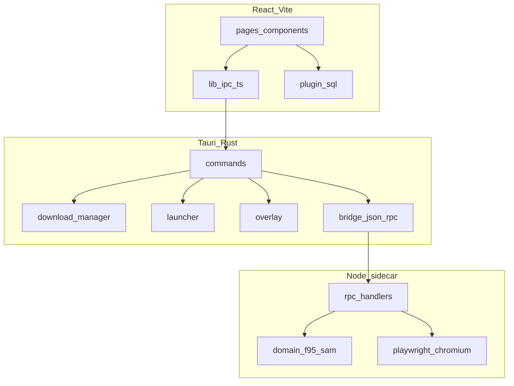

# F95 App

**Языки:** [English](README.md) · [Português (BR)](README.pt-BR.md) · [Deutsch](README.de.md) · Русский

Десктопный клиент для [F95Zone](https://f95zone.to/). Просмотр каталога SAM, управление локальной библиотекой, загрузка с разных файловых хостов, запуск игр и работа офлайн при обрыве сети.

Репозиторий: [github.com/jky-sh/f95-app](https://github.com/jky-sh/f95-app)

<!-- добавить скриншоты перед релизом -->

---

## Что делает приложение

F95 App оборачивает F95Zone в оболочку Tauri с интерфейсом, ближе к игровому лаунчеру, чем к вкладке браузера. Один раз входите в аккаунт, ищете и фильтруете треды через SAM, ставите загрузки в очередь в выбранные библиотеки установки и отслеживаете время игры по каждому тайтлу.

Бэкенд делит работу между Rust (загрузки, лаунчер, оверлей) и Node.js sidecar (HTTP к F95 + Playwright для страниц, блокирующих простые запросы).

---

## Возможности

- **Аутентификация** — отдельное окно входа, опциональный remember-me через vault Stronghold
- **Магазин** — каталог SAM с фильтрами префиксов/тегов, поиском, сортировкой, пагинацией
- **Библиотека** — установленные тайтлы, версии, время игры, несколько папок установки
- **Загрузки** — очередь с прогрессом в реальном времени, авто-распаковка (zip/7z/rar), миграция сейвов
- **Файловые хосты** — GoFile, MEGA, UploadHaven, BuzzHeavier, Datanodes, MixDrop, Google Drive, WorkUpload, MediaFire, Pixeldrain
- **Капча** — интерактивный MixDrop через отдельное окно webview
- **Социальное** — список following, алерты F95, RSS-лента обновлений библиотеки
- **Офлайн** — кэшированный профиль и локальная библиотека без сети
- **Оверлей** — экспериментальный in-game оверлей в Windows (заметки, гайды, hotkey)
- **i18n** — португальский, английский, немецкий, русский

---

## Архитектура

Три слоя: React frontend → Tauri/Rust → Node sidecar.



Подробности: [docs/ARCHITECTURE.ru.md](docs/ARCHITECTURE.ru.md)

---

## Структура проекта

```
f95-app/
├── src/                      # React frontend
│   ├── pages/                # Страницы маршрутов (store, library, downloads, …)
│   ├── components/           # UI-компоненты
│   ├── contexts/             # React-провайдеры состояния
│   ├── lib/                  # IPC-мост, db, settings, i18n, тема
│   ├── locales/              # Строки перевода (pt, en, de, ru)
│   └── styles/               # CSS-модули
├── src-tauri/                # Rust backend
│   ├── src/
│   │   ├── commands/         # Обработчики Tauri invoke
│   │   ├── download/         # Менеджер загрузок + резолверы хостов
│   │   ├── bridge.rs         # JSON-RPC к sidecar
│   │   ├── launcher.rs       # Управление процессами игр
│   │   └── overlay*.rs       # In-game оверлей (Windows)
│   ├── sidecar/              # Node.js процесс f95-bridge
│   │   └── src/
│   │       ├── rpc/handlers/ # Auth, SAM, резолверы
│   │       └── domain/       # Парсеры F95, SAM, game
│   └── tauri.conf.json
├── docs/                     # Техническая документация
└── scripts/                  # Скрипты сборки (битмапы инсталлятора, CSS)
```

---

## Требования

| Инструмент | Версия |
|------------|--------|
| Node.js | 20+ |
| Rust | stable через [rustup](https://rustup.rs/) |
| Tauri CLI | `@tauri-apps/cli` v2 (в devDependencies) |
| Windows | WebView2 Runtime, MSVC build tools (оверлей + нативные зависимости) |

macOS и Linux собирают оболочку, но оверлей и платформенные фичи — только Windows.

---

## Быстрый старт

```bash
git clone https://github.com/jky-sh/f95-app.git
cd f95-app
npm install
npm --prefix src-tauri/sidecar install
npm run tauri dev
```

После правок TypeScript sidecar пересоберите перед тестом:

```bash
npm --prefix src-tauri/sidecar run build
```

### Зависимость `browser-rest-api`

Sidecar и frontend используют общий HTTP-клиент. Два варианта:

**Локальная разработка** — клонируйте `browser-api` рядом с `f95-app`, чтобы путь `../../../browser-api` резолвился из `src-tauri/sidecar/`. В `package.json` sidecar указано `file:../../../browser-api`.

**npm / release** — корневой `package.json` тянет `browser-rest-api@^1.0.0` из registry. Для release-сборок укажите sidecar на ту же опубликованную версию.

---

## Сборка

```bash
npm run tauri build
```

Release-пайплайн (из `tauri.conf.json`):

1. Сборка frontend → `dist/`
2. Компиляция TypeScript sidecar
3. esbuild bundle → `bundle.cjs`
4. Node SEA + Playwright Chromium
5. Удаление лишних артефактов Playwright
6. NSIS/WiX инсталлятор (Windows)

Ассеты инсталлятора: `npm run installer:assets` (PowerShell, только Windows).

Детали сборки sidecar: [src-tauri/sidecar/README.md](src-tauri/sidecar/README.md)

---

## Конфигурация

Файла `.env` нет. Учётные данные и настройки задаются в UI и хранятся локально:

| Хранилище | Содержимое |
|-----------|------------|
| SQLite `f95app.db` | Библиотека, загрузки, настройки, уведомления |
| Stronghold `vault.hold` | Пароль remember-me, сессии MEGA/UploadHaven |
| `sessions/` | Cookie F95 (папка на сессию) |
| Таблица `app_settings` | Токен GoFile, ключи MixDrop, ключ Datanodes и т.д. |

Папка загрузок по умолчанию: `<app_local_data_dir>/downloads/`.

---

## Поддерживаемые платформы

| Платформа | Поддержка |
|-----------|-----------|
| Windows | Полная — загрузки, лаунчер, оверлей, ярлыки |
| macOS | Частичная — без оверлея, ограниченные хосты |
| Linux | Частичная — те же ограничения, что у macOS |

---

## Участие в разработке

См. [CONTRIBUTING.ru.md](CONTRIBUTING.ru.md) — именование веток, формат коммитов, чеклист PR.

---

## Поддержка

F95 App — побочный проект. Если он экономит вам время, кофе помогает продолжать разработку:

[](https://ko-fi.com/Z8R020T4GC)

---

## Лицензия

Copyright (c) 2026 jky-sh / F95 App

Распространяется под [GNU General Public License v3.0 или позднее](LICENSE).
