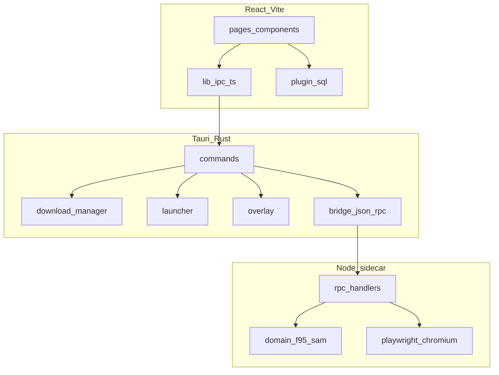

# F95 App — Architektur

**Sprachen:** [English](ARCHITECTURE.md) · [Português (BR)](ARCHITECTURE.pt-BR.md) · Deutsch · [Русский](ARCHITECTURE.ru.md)

Technische Referenz für Mitwirkende. Setup und Nutzung: [README](../README.de.md).

---

## Überblick

F95 App ist ein Desktop-Client in drei Schichten:

1. **Frontend** — React 19 + Vite, gerendert in Tauri WebView2
2. **Tauri (Rust)** — IPC-Befehle, Download-Engine, Game-Launcher, Overlay, SQLite-Migrationen
3. **Sidecar (Node.js)** — F95Zone/SAM-API-Zugriff über HTTP und Playwright



Daten fließen bei Anfragen nach unten; Events (Download-Fortschritt, Overlay-Status) nach oben über Tauri-Events und React Context.

---

## Fenstermodell

Tauri definiert drei Fenster-Templates in `src-tauri/tauri.conf.json`:

| Label | Beim Start erstellt | Zweck |
|-------|---------------------|-------|
| `login` | Ja | Auth-Formular, 420×560, rahmenlos |
| `game-overlay` | Nein (`create: false`) | In-Game-Overlay, transparent, always-on-top |
| `overlay-hint` | Nein | Hotkey-Hinweis beim Spielstart |

Das Hauptfenster wird nach Login via `complete_login` erstellt. `src/App.tsx` wählt die Root-Komponente per Fenster-Label oder `?window=`:

- `login` → `LoginWindow`
- `main` (Standard) → `MainAppGate` + React Router
- `game-overlay` → `GameOverlayRoot`
- `overlay-hint` → `OverlayHintRoot`

Login-Ablauf: Credentials → Rust ruft Sidecar `login` → Erfolg → Frontend ruft `complete_login` → Login-Fenster schließt, Hauptfenster öffnet mit gespeicherter Session.

---

## Frontend → Rust IPC

Alle Backend-Aufrufe laufen über `src/lib/ipc.ts`, typisierter Wrapper um Tauris `invoke()`. Jede exportierte Funktion mappt 1:1 auf einen in `src-tauri/src/lib.rs` registrierten `#[tauri::command]`.

Befehlsgruppen:

- **Auth / Netzwerk** — `login`, `logout`, `get_profile`, `is_logged_in`, `has_local_session`, `check_network`, `ping_sidecar`
- **Katalog** — `sam_list`, `sam_tag_search`, `sam_options`, `game_detail`
- **Social / Feeds** — `get_following`, `fetch_rss_feed`, `fetch_alerts_popup`, `fetch_alerts_list`
- **Downloads** — `download_start`, `download_cancel`, `download_continue_choice`, `download_continue_captcha`, `open_captcha_window`, `close_captcha_window`
- **Host-Credentials** — `set_*` / `verify_*` / `login_*` für GoFile, MEGA, UploadHaven, BuzzHeavier, Datanodes, MixDrop
- **Dateisystem** — `extract_archive`, `scan_install_media`, `resolve_media_preview`, `migrate_saves`, `move_install_start`, `disk_info`, `reveal_in_explorer`
- **Launcher** — `launch_game`, `stop_game`, `running_games`, `create_game_shortcuts`
- **Overlay** — `overlay_ensure`, `overlay_show`, `overlay_hide`, `overlay_toggle`, `overlay_set_context`, `overlay_sync_hotkey`, etc.

Rust-Fehler deserialisieren zu `BackendError` (`src/types.ts`).

---

## Rust → Sidecar Bridge

`src-tauri/src/bridge.rs` startet den Sidecar-Prozess und spricht JSON-RPC über stdin/stdout.

**Dev** (`tauri dev`): Tauri führt `node dist/index.js` aus `src-tauri/sidecar/dist/` aus.

**Release**: gebündelt `bundle.cjs` + `node.exe` + Playwright Chromium (siehe [Sidecar README](../src-tauri/sidecar/README.md)).

RPC-Methoden in `src-tauri/sidecar/src/contract/rpc-methods.ts` — müssen mit dem Rust-Client synchron bleiben. Wichtigste:

| Methode | Rolle |
|---------|-------|
| `init` | Session-Verzeichnis binden |
| `login` / `logout` / `getProfile` | F95-Auth |
| `samList` / `samTagSearch` / `samOptions` | SAM-Katalog |
| `gameDetail` | Thread-Seiten-Parse |
| `fetchRss` / `fetchAlertsPopup` / `fetchAlertsList` | Benachrichtigungen |
| `unmaskUrl` | Maskierte F95-Links dekodieren |
| `resolveGofile` / `resolveMixdrop` / `resolveGdrive` / … | Host-URL → Direkt-Download |
| `resolveMixdropInteractive` | Playwright für Captcha |

Der Sidecar nutzt Playwright, wenn plain HTTP Cloudflare trifft oder MixDrop interaktives Captcha braucht. Cheerio parst HTML; `fast-xml-parser` verarbeitet RSS und Alert-XML.

---

## Download-Pipeline

Downloads werden in `src-tauri/src/download/` orchestriert. Ablauf:

1. Frontend ruft `download_start` mit Thread-ID, Host-URL, Bibliothekspfad
2. Rust löst Direkt-URL auf:
   - Manche Hoster in Rust (`mega.rs`, `gdrive.rs`, `uploadhaven.rs`, `buzzheavier.rs`)
   - Andere an Sidecar-Resolver delegiert
3. `reqwest` streamt Bytes auf Disk; Fortschritts-Events ans Frontend
4. Nach Abschluss entpackt `extraction.rs` zip/7z/rar bei aktiviertem Auto-Extract
5. Bibliothekszeile aktualisiert; optionale Save-Migration via `save_migration.rs`

Sonderfälle:

- **GoFile Multi-Build** — Resolver liefert mehrere Dateien; UI fragt via `download_continue_choice`
- **MixDrop Captcha** — `open_captcha_window` lädt Webview; Nutzer löst Captcha; `download_continue_captcha` setzt fort
- **MEGA / UploadHaven** — Session in Stronghold oder `app_settings`; vor Download verifiziert

Unterstützte Hoster: GoFile, MEGA, UploadHaven, BuzzHeavier, Datanodes, MixDrop, Google Drive, WorkUpload, MediaFire, Pixeldrain.

---

## Lokale Persistenz

### SQLite (`f95app.db`)

Verwaltet durch `@tauri-apps/plugin-sql`. Schema-Migrationen v1–v7 in `src-tauri/src/migrations.rs`:

| Version | Änderung |
|---------|----------|
| v1 | `games_cache`, `library_games`, `play_sessions`, `downloads` |
| v2 | `downloads.game_version` |
| v3 | `install_libraries`, `downloads.library_path` |
| v4 | `app_settings` (Host-Tokens, Einstellungen) |
| v5 | `library_games.category` |
| v6 | `achievement_definitions`, `user_achievement_unlocks` |
| v7 | `notifications`, `rss_seen_guids` |

Frontend liest/schreibt via `src/lib/db.ts` und Domain-Module (`library.ts`, `downloads.ts`, `settings.ts`).

### Stronghold

`@tauri-apps/plugin-stronghold` speichert Login-Passwort (Remember-me) und sensible Host-Sessions (MEGA, UploadHaven). Datei: `<app_local_data_dir>/vault.hold`.

### Session-Dateien

F95-Cookies in `<app_local_data_dir>/sessions/`, ein Verzeichnis pro Session-ID. Sidecar `init` erhält den Pfad beim Start.

### Standard-Pfade

| Pfad | Inhalt |
|------|--------|
| `<app_local_data_dir>/downloads/` | Standard-Installationsbibliothek |
| `<app_local_data_dir>/f95app.db` | SQLite-Datenbank |
| `<app_local_data_dir>/sessions/` | F95-Cookie-Jars |
| `<app_local_data_dir>/vault.hold` | Stronghold-Vault |

---

## Frontend-State

Kein Redux oder Zustand. State aufgeteilt in React Context:

| Context | Datei | Verantwortung |
|---------|-------|---------------|
| `OfflineProvider` | `contexts/Offline.tsx` | Netzwerkerkennung, Offline-Gate |
| `DownloadsProvider` | `contexts/Downloads.tsx` | Download-Warteschlange + Fortschritt |
| `DownloadSettingsProvider` | `contexts/DownloadSettings.tsx` | Geschwindigkeitslimits, Auto-Extract |
| `StoreSettingsProvider` | `contexts/StoreSettings.tsx` | Store-Filter, Scroll-Position |
| `RunningGamesProvider` | `contexts/RunningGames.tsx` | Aktive Spiel-PIDs |
| `NotificationsProvider` | `contexts/Notifications.tsx` | Alerts + RSS |
| `PrefixCatalogContext` | `contexts/PrefixCatalogContext.tsx` | SAM-Prefix-Cache |
| `TagCatalogContext` | `contexts/TagCatalogContext.tsx` | SAM-Tag-Cache |

Routing: `src/router.tsx` (React Router v7). Seiten unter `src/pages/`.

i18n: eigene Implementierung in `src/lib/i18n.ts` — Locales in `src/locales/` (pt, en, de, ru).

Theming: CSS Custom Properties in `src/styles/theme.css`, angewendet via `src/lib/theme.ts`.

---

## Game-Launcher und Overlay

`src-tauri/src/launcher.rs` startet die Spiel-EXE, trackt PID, zeichnet Spielsitzungen auf und kann das Overlay-Hinweis-Fenster zeigen.

`src-tauri/src/overlay.rs` (mit `overlay_anchor.rs`, `overlay_hotkey.rs`, `game_window.rs`) implementiert ein Win32-Overlay, das am Spielfenster verankert ist:

- Globaler Hotkey via `tauri-plugin-global-shortcut`
- Transparentes WebView-Fenster (`game-overlay`) über dem Spiel
- Kontext aus der Haupt-App: Notizen, Guides, eingebetteter Browser, Achievement-Shell

**Status:** experimentell. Nur Windows. Erfordert experimentellen Overlay-Schalter in den Einstellungen.

---

## Build-Pipeline

### Entwicklung

```bash
npm install
npm --prefix src-tauri/sidecar install
npm run tauri dev
```

`beforeDevCommand` startet Vite auf Port 1420. Sidecar muss nach Codeänderungen kompiliert werden.

### Release

`beforeBuildCommand` in `tauri.conf.json`:

1. `npm run build` — Frontend → `dist/`
2. `npm --prefix src-tauri/sidecar run build` — TypeScript → `dist/index.js`
3. `build:bundle` — esbuild → `dist/bundle.cjs`
4. `build:sea` — kopiert `node.exe`, Playwright, Chromium

`beforeBundleCommand` führt `build:prune` aus, um unnötige Playwright-Artefakte zu entfernen.

Installer: NSIS + WiX unter Windows, WebView2 Embed Bootstrapper.

---

## `browser-rest-api`-Abhängigkeit

HTTP-Client von Frontend und Sidecar genutzt:

- **Lokales Dev** — Sidecar-`package.json` zeigt auf `file:../../../browser-api`. `browser-api` als Geschwister von `f95-app` klonen.
- **npm Release** — Root-`package.json` nutzt `browser-rest-api@^1.0.0` aus dem Registry. Sidecar für Release-Builds auf veröffentlichtes Paket ausrichten.

---

## Wo was ändern

| Aufgabe | Ort |
|---------|-----|
| UI-Seite oder Komponente | `src/pages/`, `src/components/` |
| Neuer Tauri-Befehl | `src-tauri/src/commands/`, in `lib.rs` registrieren, in `src/lib/ipc.ts` ergänzen |
| Download-Host-Logik | `src-tauri/src/download/` oder Sidecar `domain/resolvers/` |
| F95-HTML-Parsing | `src-tauri/sidecar/src/domain/f95/`, `domain/sam/` |
| Datenbankschema | `src-tauri/src/migrations.rs` + Frontend `src/lib/db.ts` |
| Übersetzungen | `src/locales/*.ts` |
| Overlay-Verhalten | `src-tauri/src/overlay*.rs`, `src/components/overlay/` |

---

## Plattform-Hinweise

| Plattform | Status |
|-----------|--------|
| Windows | Voller Support — Overlay, Shortcuts, alle Download-Hosts |
| macOS / Linux | Tauri-Shell läuft; Overlay und Win32-Features nicht verfügbar |

---

## Lizenz

GNU General Public License v3 oder später. Siehe [LICENSE](../LICENSE).
