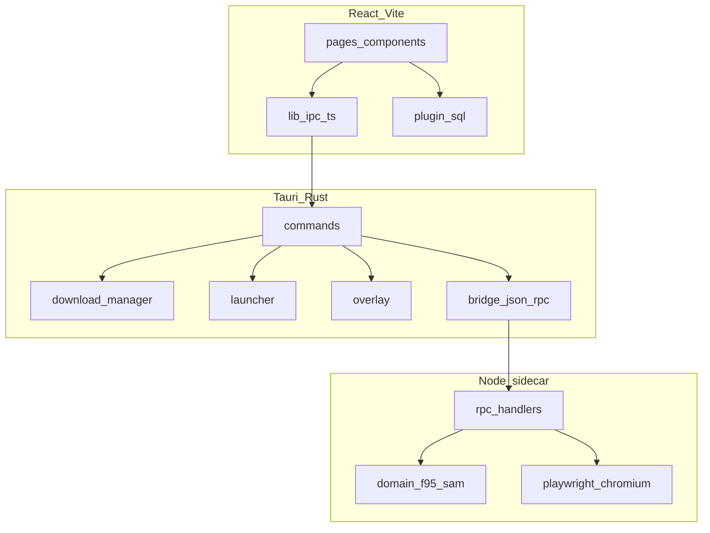

# F95 App — Architecture

**Languages:** English | [Português (BR)](ARCHITECTURE.pt-BR.md) | [Deutsch](ARCHITECTURE.de.md) | [Русский](ARCHITECTURE.ru.md)

Technical reference for contributors. For setup and usage, see the [README](../README.md).

---

## Overview

F95 App is a three-layer desktop client:

1. **Frontend** — React 19 + Vite, rendered inside Tauri WebView2
2. **Tauri (Rust)** — IPC commands, download engine, game launcher, overlay, SQLite migrations
3. **Sidecar (Node.js)** — F95Zone/SAM API access via HTTP and Playwright



Data flows down on requests; events (download progress, overlay state) flow up through Tauri events and React context.

---

## Window model

Tauri defines three window templates in `src-tauri/tauri.conf.json`:

| Label | Created at startup | Purpose |
|-------|-------------------|---------|
| `login` | Yes | Auth form, 420×560, frameless |
| `game-overlay` | No (`create: false`) | In-game overlay, transparent, always-on-top |
| `overlay-hint` | No | Hotkey hint shown when a game launches |

The main app window is created after login via `complete_login`. `src/App.tsx` picks the root component from the window label or `?window=` query param:

- `login` → `LoginWindow`
- `main` (default) → `MainAppGate` + React Router
- `game-overlay` → `GameOverlayRoot`
- `overlay-hint` → `OverlayHintRoot`

Login flow: user submits credentials → Rust calls sidecar `login` → on success, frontend calls `complete_login` → login window closes, main window opens with stored session.

---

## Frontend → Rust IPC

All backend calls go through `src/lib/ipc.ts`, a typed wrapper over Tauri's `invoke()`. Each exported function maps 1:1 to a `#[tauri::command]` registered in `src-tauri/src/lib.rs`.

Command groups:

- **Auth / network** — `login`, `logout`, `get_profile`, `is_logged_in`, `has_local_session`, `check_network`, `ping_sidecar`
- **Catalog** — `sam_list`, `sam_tag_search`, `sam_options`, `game_detail`
- **Social / feeds** — `get_following`, `fetch_rss_feed`, `fetch_alerts_popup`, `fetch_alerts_list`
- **Downloads** — `download_start`, `download_cancel`, `download_continue_choice`, `download_continue_captcha`, `open_captcha_window`, `close_captcha_window`
- **Host credentials** — `set_*` / `verify_*` / `login_*` for GoFile, MEGA, UploadHaven, BuzzHeavier, Datanodes, MixDrop
- **Filesystem** — `extract_archive`, `scan_install_media`, `resolve_media_preview`, `migrate_saves`, `move_install_start`, `disk_info`, `reveal_in_explorer`
- **Launcher** — `launch_game`, `stop_game`, `running_games`, `create_game_shortcuts`
- **Overlay** — `overlay_ensure`, `overlay_show`, `overlay_hide`, `overlay_toggle`, `overlay_set_context`, `overlay_sync_hotkey`, etc.

Errors from Rust deserialize into `BackendError` (`src/types.ts`).

---

## Rust → sidecar bridge

`src-tauri/src/bridge.rs` spawns the sidecar process and speaks JSON-RPC over stdin/stdout.

**Dev** (`tauri dev`): Tauri runs `node dist/index.js` from `src-tauri/sidecar/dist/`.

**Release**: bundled `bundle.cjs` + `node.exe` + Playwright Chromium (see [sidecar README](../src-tauri/sidecar/README.md)).

RPC methods are defined in `src-tauri/sidecar/src/contract/rpc-methods.ts` and must stay in sync with the Rust client. Main methods:

| Method | Role |
|--------|------|
| `init` | Bind session directory |
| `login` / `logout` / `getProfile` | F95 auth |
| `samList` / `samTagSearch` / `samOptions` | SAM catalog |
| `gameDetail` | Thread page parse |
| `fetchRss` / `fetchAlertsPopup` / `fetchAlertsList` | Notifications |
| `unmaskUrl` | Decode masked F95 links |
| `resolveGofile` / `resolveMixdrop` / `resolveGdrive` / … | Host URL → direct download |
| `resolveMixdropInteractive` | Opens Playwright for captcha |

The sidecar uses Playwright when plain HTTP hits Cloudflare or when MixDrop needs interactive captcha. Cheerio parses HTML; `fast-xml-parser` handles RSS and alert XML.

---

## Download pipeline

Downloads are orchestrated in `src-tauri/src/download/`. Flow:

1. Frontend calls `download_start` with thread ID, host URL, target library path
2. Rust resolves the direct URL:
   - Some hosts handled in Rust (`mega.rs`, `gdrive.rs`, `uploadhaven.rs`, `buzzheavier.rs`)
   - Others delegated to sidecar resolvers
3. `reqwest` streams bytes to disk; progress events emitted to frontend
4. On completion, `extraction.rs` unpacks zip/7z/rar if auto-extract is enabled
5. Library row updated; optional save migration via `save_migration.rs`

Special cases:

- **GoFile multi-build** — resolver returns multiple files; UI prompts via `download_continue_choice`
- **MixDrop captcha** — `open_captcha_window` loads a webview; user solves captcha; `download_continue_captcha` resumes
- **MEGA / UploadHaven** — session stored in Stronghold or `app_settings`; verified before download

Supported hosts: GoFile, MEGA, UploadHaven, BuzzHeavier, Datanodes, MixDrop, Google Drive, WorkUpload, MediaFire, Pixeldrain.

---

## Local persistence

### SQLite (`f95app.db`)

Managed by `@tauri-apps/plugin-sql`. Schema migrations v1–v7 in `src-tauri/src/migrations.rs`:

| Version | Change |
|---------|--------|
| v1 | `games_cache`, `library_games`, `play_sessions`, `downloads` |
| v2 | `downloads.game_version` |
| v3 | `install_libraries`, `downloads.library_path` |
| v4 | `app_settings` (host tokens, preferences) |
| v5 | `library_games.category` |
| v6 | `achievement_definitions`, `user_achievement_unlocks` |
| v7 | `notifications`, `rss_seen_guids` |

Frontend reads/writes via `src/lib/db.ts` and domain modules (`library.ts`, `downloads.ts`, `settings.ts`).

### Stronghold

`@tauri-apps/plugin-stronghold` stores login password (remember-me) and sensitive host sessions (MEGA, UploadHaven). Vault file: `<app_local_data_dir>/vault.hold`.

### Session files

F95 cookies live in `<app_local_data_dir>/sessions/`, one directory per session ID. Sidecar `init` receives the path on startup.

### Default paths

| Path | Contents |
|------|----------|
| `<app_local_data_dir>/downloads/` | Default install library |
| `<app_local_data_dir>/f95app.db` | SQLite database |
| `<app_local_data_dir>/sessions/` | F95 session cookies |
| `<app_local_data_dir>/vault.hold` | Stronghold vault |

---

## Frontend state

No Redux or Zustand. State is split across React Context providers:

| Context | File | Responsibility |
|---------|------|----------------|
| `OfflineProvider` | `contexts/Offline.tsx` | Network detection, offline gate |
| `DownloadsProvider` | `contexts/Downloads.tsx` | Download queue + progress |
| `DownloadSettingsProvider` | `contexts/DownloadSettings.tsx` | Speed limits, auto-extract |
| `StoreSettingsProvider` | `contexts/StoreSettings.tsx` | Store filters, scroll position |
| `RunningGamesProvider` | `contexts/RunningGames.tsx` | Active game PIDs |
| `NotificationsProvider` | `contexts/Notifications.tsx` | Alerts + RSS |
| `PrefixCatalogContext` | `contexts/PrefixCatalogContext.tsx` | SAM prefix cache |
| `TagCatalogContext` | `contexts/TagCatalogContext.tsx` | SAM tag cache |

Routing: `src/router.tsx` (React Router v7). Pages under `src/pages/`.

i18n: custom implementation in `src/lib/i18n.ts` — locales in `src/locales/` (pt, en, de, ru). No react-i18next.

Theming: CSS custom properties in `src/styles/theme.css`, applied via `src/lib/theme.ts`.

---

## Game launcher and overlay

`src-tauri/src/launcher.rs` spawns the game executable, tracks PID, records play sessions, and optionally shows the overlay hint window.

`src-tauri/src/overlay.rs` (with `overlay_anchor.rs`, `overlay_hotkey.rs`, `game_window.rs`) implements a Win32 overlay that anchors to the game window. Features:

- Global hotkey via `tauri-plugin-global-shortcut`
- Transparent WebView window (`game-overlay`) positioned over the game
- Context passed from main app: notes, guides, embedded browser, achievements shell

**Status:** experimental. Windows only. Requires the experimental overlay toggle in Settings.

---

## Build pipeline

### Development

```bash
npm install
npm --prefix src-tauri/sidecar install
npm run tauri dev
```

`beforeDevCommand` starts Vite on port 1420. Sidecar must be compiled (`npm --prefix src-tauri/sidecar run build`) after code changes.

### Release

`beforeBuildCommand` in `tauri.conf.json`:

1. `npm run build` — frontend → `dist/`
2. `npm --prefix src-tauri/sidecar run build` — TypeScript → `dist/index.js`
3. `build:bundle` — esbuild → `dist/bundle.cjs`
4. `build:sea` — copy `node.exe`, Playwright, Chromium

`beforeBundleCommand` runs `build:prune` to strip unnecessary Playwright artifacts.

Installer: NSIS + WiX on Windows, WebView2 embed bootstrapper.

---

## `browser-rest-api` dependency

The HTTP client used by both frontend and sidecar:

- **Local dev** — sidecar `package.json` points to `file:../../../browser-api`. Clone the `browser-api` repo as a sibling of `f95-app`.
- **npm release** — root `package.json` uses `browser-rest-api@^1.0.0` from the registry. For release builds, align the sidecar dependency to the published package.

---

## Where to change what

| Task | Location |
|------|----------|
| UI page or component | `src/pages/`, `src/components/` |
| New Tauri command | `src-tauri/src/commands/`, register in `lib.rs`, add to `src/lib/ipc.ts` |
| Download host logic | `src-tauri/src/download/` or sidecar `domain/resolvers/` |
| F95 HTML parsing | `src-tauri/sidecar/src/domain/f95/`, `domain/sam/` |
| Database schema | `src-tauri/src/migrations.rs` + frontend `src/lib/db.ts` |
| Translations | `src/locales/*.ts` |
| Overlay behavior | `src-tauri/src/overlay*.rs`, `src/components/overlay/` |

---

## Platform notes

| Platform | Status |
|----------|--------|
| Windows | Full support — overlay, shortcuts, all download hosts |
| macOS / Linux | Tauri shell runs; overlay and some Win32-specific features unavailable |

---

## License

GNU General Public License v3 or later. See [LICENSE](../LICENSE).
