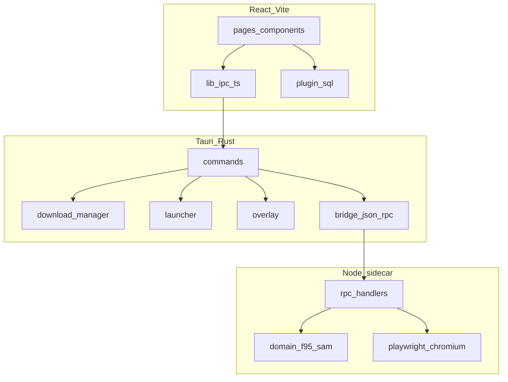

# F95 App — Arquitetura

**Idiomas:** [English](ARCHITECTURE.md) · Português (BR) · [Deutsch](ARCHITECTURE.de.md) · [Русский](ARCHITECTURE.ru.md)

Referência técnica para contribuidores. Para setup e uso, veja o [README](../README.pt-BR.md).

---

## Visão geral

O F95 App é um cliente desktop em três camadas:

1. **Frontend** — React 19 + Vite, renderizado no WebView2 do Tauri
2. **Tauri (Rust)** — comandos IPC, engine de download, launcher de jogos, overlay, migrações SQLite
3. **Sidecar (Node.js)** — acesso à API F95Zone/SAM via HTTP e Playwright



Dados descem nas requisições; eventos (progresso de download, estado do overlay) sobem via eventos Tauri e React context.

---

## Modelo de janelas

O Tauri define três templates de janela em `src-tauri/tauri.conf.json`:

| Label | Criada no startup | Função |
|-------|-------------------|--------|
| `login` | Sim | Formulário de auth, 420×560, sem moldura |
| `game-overlay` | Não (`create: false`) | Overlay in-game, transparente, always-on-top |
| `overlay-hint` | Não | Dica de hotkey ao lançar jogo |

A janela principal é criada após login via `complete_login`. `src/App.tsx` escolhe o componente raiz pelo label da janela ou query `?window=`:

- `login` → `LoginWindow`
- `main` (padrão) → `MainAppGate` + React Router
- `game-overlay` → `GameOverlayRoot`
- `overlay-hint` → `OverlayHintRoot`

Fluxo de login: credenciais → Rust chama sidecar `login` → sucesso → frontend chama `complete_login` → janela de login fecha, principal abre com sessão salva.

---

## IPC frontend → Rust

Todas as chamadas ao backend passam por `src/lib/ipc.ts`, wrapper tipado sobre `invoke()` do Tauri. Cada função exportada mapeia 1:1 para um `#[tauri::command]` registrado em `src-tauri/src/lib.rs`.

Grupos de comandos:

- **Auth / rede** — `login`, `logout`, `get_profile`, `is_logged_in`, `has_local_session`, `check_network`, `ping_sidecar`
- **Catálogo** — `sam_list`, `sam_tag_search`, `sam_options`, `game_detail`
- **Social / feeds** — `get_following`, `fetch_rss_feed`, `fetch_alerts_popup`, `fetch_alerts_list`
- **Downloads** — `download_start`, `download_cancel`, `download_continue_choice`, `download_continue_captcha`, `open_captcha_window`, `close_captcha_window`
- **Credenciais de hosts** — `set_*` / `verify_*` / `login_*` para GoFile, MEGA, UploadHaven, BuzzHeavier, Datanodes, MixDrop
- **Filesystem** — `extract_archive`, `scan_install_media`, `resolve_media_preview`, `migrate_saves`, `move_install_start`, `disk_info`, `reveal_in_explorer`
- **Launcher** — `launch_game`, `stop_game`, `running_games`, `create_game_shortcuts`
- **Overlay** — `overlay_ensure`, `overlay_show`, `overlay_hide`, `overlay_toggle`, `overlay_set_context`, `overlay_sync_hotkey`, etc.

Erros do Rust deserializam em `BackendError` (`src/types.ts`).

---

## Bridge Rust → sidecar

`src-tauri/src/bridge.rs` spawna o processo sidecar e fala JSON-RPC via stdin/stdout.

**Dev** (`tauri dev`): Tauri executa `node dist/index.js` de `src-tauri/sidecar/dist/`.

**Release**: empacotado `bundle.cjs` + `node.exe` + Playwright Chromium (veja [README do sidecar](../src-tauri/sidecar/README.md)).

Métodos RPC definidos em `src-tauri/sidecar/src/contract/rpc-methods.ts` — devem ficar em sync com o cliente Rust. Principais:

| Método | Função |
|--------|--------|
| `init` | Vincula diretório de sessão |
| `login` / `logout` / `getProfile` | Auth F95 |
| `samList` / `samTagSearch` / `samOptions` | Catálogo SAM |
| `gameDetail` | Parse da página da thread |
| `fetchRss` / `fetchAlertsPopup` / `fetchAlertsList` | Notificações |
| `unmaskUrl` | Decodifica links mascarados F95 |
| `resolveGofile` / `resolveMixdrop` / `resolveGdrive` / … | URL do host → download direto |
| `resolveMixdropInteractive` | Abre Playwright para captcha |

O sidecar usa Playwright quando HTTP simples encontra Cloudflare ou quando MixDrop precisa de captcha interativo. Cheerio faz parse HTML; `fast-xml-parser` trata RSS e XML de alertas.

---

## Pipeline de download

Downloads orquestrados em `src-tauri/src/download/`. Fluxo:

1. Frontend chama `download_start` com thread ID, URL do host, pasta da biblioteca
2. Rust resolve URL direta:
   - Alguns hosts no Rust (`mega.rs`, `gdrive.rs`, `uploadhaven.rs`, `buzzheavier.rs`)
   - Outros delegados aos resolvers do sidecar
3. `reqwest` faz stream para disco; eventos de progresso para o frontend
4. Ao concluir, `extraction.rs` descompacta zip/7z/rar se auto-extract estiver ativo
5. Linha da biblioteca atualizada; migração de saves opcional via `save_migration.rs`

Casos especiais:

- **GoFile multi-build** — resolver retorna vários arquivos; UI pergunta via `download_continue_choice`
- **Captcha MixDrop** — `open_captcha_window` abre webview; usuário resolve; `download_continue_captcha` retoma
- **MEGA / UploadHaven** — sessão no Stronghold ou `app_settings`; verificada antes do download

Hosts suportados: GoFile, MEGA, UploadHaven, BuzzHeavier, Datanodes, MixDrop, Google Drive, WorkUpload, MediaFire, Pixeldrain.

---

## Persistência local

### SQLite (`f95app.db`)

Gerenciado por `@tauri-apps/plugin-sql`. Migrações v1–v7 em `src-tauri/src/migrations.rs`:

| Versão | Mudança |
|--------|---------|
| v1 | `games_cache`, `library_games`, `play_sessions`, `downloads` |
| v2 | `downloads.game_version` |
| v3 | `install_libraries`, `downloads.library_path` |
| v4 | `app_settings` (tokens de hosts, preferências) |
| v5 | `library_games.category` |
| v6 | `achievement_definitions`, `user_achievement_unlocks` |
| v7 | `notifications`, `rss_seen_guids` |

Frontend lê/escreve via `src/lib/db.ts` e módulos de domínio (`library.ts`, `downloads.ts`, `settings.ts`).

### Stronghold

`@tauri-apps/plugin-stronghold` guarda senha de login (remember-me) e sessões sensíveis (MEGA, UploadHaven). Arquivo: `<app_local_data_dir>/vault.hold`.

### Arquivos de sessão

Cookies F95 em `<app_local_data_dir>/sessions/`, um diretório por session ID. Sidecar `init` recebe o path no startup.

### Paths padrão

| Path | Conteúdo |
|------|----------|
| `<app_local_data_dir>/downloads/` | Biblioteca de instalação padrão |
| `<app_local_data_dir>/f95app.db` | Banco SQLite |
| `<app_local_data_dir>/sessions/` | Cookie jars F95 |
| `<app_local_data_dir>/vault.hold` | Vault Stronghold |

---

## Estado no frontend

Sem Redux ou Zustand. Estado dividido em React Context:

| Context | Arquivo | Responsabilidade |
|---------|---------|------------------|
| `OfflineProvider` | `contexts/Offline.tsx` | Detecção de rede, gate offline |
| `DownloadsProvider` | `contexts/Downloads.tsx` | Fila + progresso |
| `DownloadSettingsProvider` | `contexts/DownloadSettings.tsx` | Limites de velocidade, auto-extract |
| `StoreSettingsProvider` | `contexts/StoreSettings.tsx` | Filtros da loja, scroll |
| `RunningGamesProvider` | `contexts/RunningGames.tsx` | PIDs de jogos ativos |
| `NotificationsProvider` | `contexts/Notifications.tsx` | Alertas + RSS |
| `PrefixCatalogContext` | `contexts/PrefixCatalogContext.tsx` | Cache de prefixos SAM |
| `TagCatalogContext` | `contexts/TagCatalogContext.tsx` | Cache de tags SAM |

Roteamento: `src/router.tsx` (React Router v7). Páginas em `src/pages/`.

i18n: implementação própria em `src/lib/i18n.ts` — locales em `src/locales/` (pt, en, de, ru).

Tema: CSS custom properties em `src/styles/theme.css`, aplicado via `src/lib/theme.ts`.

---

## Launcher e overlay

`src-tauri/src/launcher.rs` spawna o executável, rastreia PID, grava sessões de jogo e pode mostrar a janela de dica do overlay.

`src-tauri/src/overlay.rs` (com `overlay_anchor.rs`, `overlay_hotkey.rs`, `game_window.rs`) implementa overlay Win32 ancorado à janela do jogo:

- Hotkey global via `tauri-plugin-global-shortcut`
- Janela WebView transparente (`game-overlay`) sobre o jogo
- Contexto do app principal: notas, guias, browser embutido, shell de conquistas

**Status:** experimental. Só Windows. Requer toggle experimental em Configurações.

---

## Pipeline de build

### Desenvolvimento

```bash
npm install
npm --prefix src-tauri/sidecar install
npm run tauri dev
```

`beforeDevCommand` inicia Vite na porta 1420. Sidecar precisa ser compilado após mudanças de código.

### Release

`beforeBuildCommand` em `tauri.conf.json`:

1. `npm run build` — frontend → `dist/`
2. `npm --prefix src-tauri/sidecar run build` — TypeScript → `dist/index.js`
3. `build:bundle` — esbuild → `dist/bundle.cjs`
4. `build:sea` — copia `node.exe`, Playwright, Chromium

`beforeBundleCommand` roda `build:prune` para remover artefatos Playwright desnecessários.

Instalador: NSIS + WiX no Windows, WebView2 embed bootstrapper.

---

## Dependência `browser-rest-api`

Cliente HTTP usado pelo frontend e sidecar:

- **Dev local** — sidecar `package.json` aponta para `file:../../../browser-api`. Clone `browser-api` como irmão de `f95-app`.
- **Release npm** — root `package.json` usa `browser-rest-api@^1.0.0` do registry. Alinhe o sidecar ao pacote publicado em builds de release.

---

## Onde mudar o quê

| Tarefa | Local |
|--------|-------|
| Página ou componente UI | `src/pages/`, `src/components/` |
| Novo comando Tauri | `src-tauri/src/commands/`, registrar em `lib.rs`, adicionar em `src/lib/ipc.ts` |
| Lógica de host de download | `src-tauri/src/download/` ou sidecar `domain/resolvers/` |
| Parse HTML F95 | `src-tauri/sidecar/src/domain/f95/`, `domain/sam/` |
| Schema do banco | `src-tauri/src/migrations.rs` + frontend `src/lib/db.ts` |
| Traduções | `src/locales/*.ts` |
| Comportamento do overlay | `src-tauri/src/overlay*.rs`, `src/components/overlay/` |

---

## Notas de plataforma

| Plataforma | Status |
|------------|--------|
| Windows | Suporte completo — overlay, atalhos, todos os hosts |
| macOS / Linux | Shell Tauri roda; overlay e features Win32 indisponíveis |

---

## Licença

GNU General Public License v3 ou posterior. Veja [LICENSE](../LICENSE).
