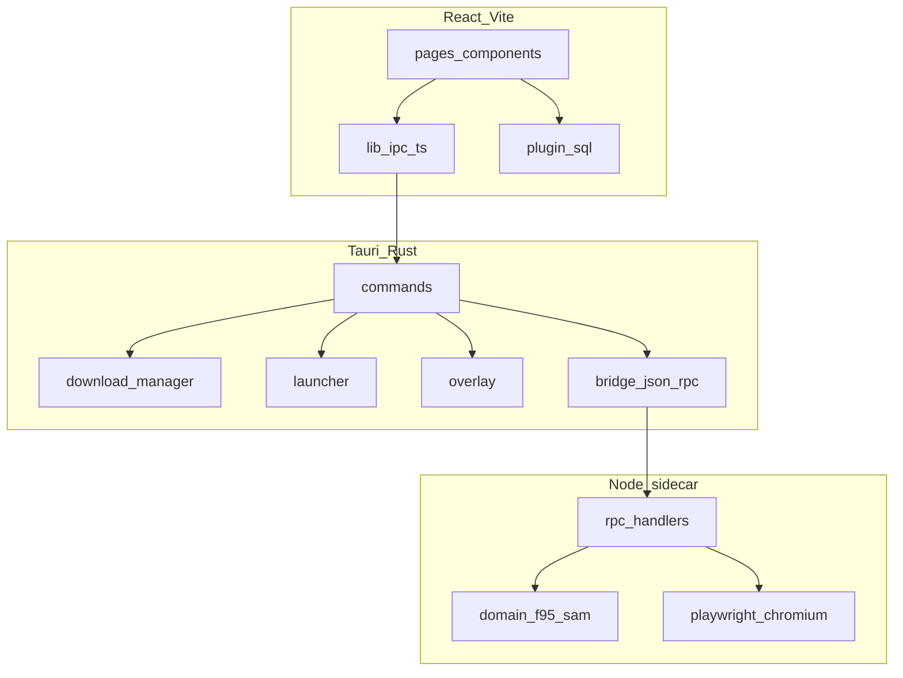

# F95 App — Архитектура

**Языки:** [English](ARCHITECTURE.md) · [Português (BR)](ARCHITECTURE.pt-BR.md) · [Deutsch](ARCHITECTURE.de.md) · Русский

Техническая справка для участников разработки. Установка и использование: [README](../README.ru.md).

---

## Обзор

F95 App — десктопный клиент из трёх слоёв:

1. **Frontend** — React 19 + Vite, рендер в WebView2 Tauri
2. **Tauri (Rust)** — IPC-команды, движок загрузок, лаунчер игр, оверлей, миграции SQLite
3. **Sidecar (Node.js)** — доступ к API F95Zone/SAM через HTTP и Playwright



Данные идут вниз по запросам; события (прогресс загрузки, состояние оверлея) — вверх через события Tauri и React context.

---

## Модель окон

Tauri задаёт три шаблона окон в `src-tauri/tauri.conf.json`:

| Label | Создаётся при старте | Назначение |
|-------|----------------------|------------|
| `login` | Да | Форма входа, 420×560, без рамки |
| `game-overlay` | Нет (`create: false`) | In-game оверлей, прозрачный, always-on-top |
| `overlay-hint` | Нет | Подсказка hotkey при запуске игры |

Главное окно создаётся после входа через `complete_login`. `src/App.tsx` выбирает корневой компонент по label окна или query `?window=`:

- `login` → `LoginWindow`
- `main` (по умолчанию) → `MainAppGate` + React Router
- `game-overlay` → `GameOverlayRoot`
- `overlay-hint` → `OverlayHintRoot`

Поток входа: учётные данные → Rust вызывает sidecar `login` → успех → frontend вызывает `complete_login` → окно входа закрывается, открывается главное с сохранённой сессией.

---

## IPC frontend → Rust

Все вызовы бэкенда идут через `src/lib/ipc.ts` — типизированная обёртка над `invoke()` Tauri. Каждая экспортируемая функция соответствует 1:1 `#[tauri::command]`, зарегистрированному в `src-tauri/src/lib.rs`.

Группы команд:

- **Auth / сеть** — `login`, `logout`, `get_profile`, `is_logged_in`, `has_local_session`, `check_network`, `ping_sidecar`
- **Каталог** — `sam_list`, `sam_tag_search`, `sam_options`, `game_detail`
- **Социальное / ленты** — `get_following`, `fetch_rss_feed`, `fetch_alerts_popup`, `fetch_alerts_list`
- **Загрузки** — `download_start`, `download_cancel`, `download_continue_choice`, `download_continue_captcha`, `open_captcha_window`, `close_captcha_window`
- **Учётные данные хостов** — `set_*` / `verify_*` / `login_*` для GoFile, MEGA, UploadHaven, BuzzHeavier, Datanodes, MixDrop
- **Файловая система** — `extract_archive`, `scan_install_media`, `resolve_media_preview`, `migrate_saves`, `move_install_start`, `disk_info`, `reveal_in_explorer`
- **Лаунчер** — `launch_game`, `stop_game`, `running_games`, `create_game_shortcuts`
- **Оверлей** — `overlay_ensure`, `overlay_show`, `overlay_hide`, `overlay_toggle`, `overlay_set_context`, `overlay_sync_hotkey`, и т.д.

Ошибки Rust десериализуются в `BackendError` (`src/types.ts`).

---

## Мост Rust → sidecar

`src-tauri/src/bridge.rs` запускает процесс sidecar и общается по JSON-RPC через stdin/stdout.

**Dev** (`tauri dev`): Tauri выполняет `node dist/index.js` из `src-tauri/sidecar/dist/`.

**Release**: упакованы `bundle.cjs` + `node.exe` + Playwright Chromium (см. [README sidecar](../src-tauri/sidecar/README.md)).

Методы RPC в `src-tauri/sidecar/src/contract/rpc-methods.ts` — должны быть синхронны с Rust-клиентом. Основные:

| Метод | Роль |
|-------|------|
| `init` | Привязка каталога сессии |
| `login` / `logout` / `getProfile` | Auth F95 |
| `samList` / `samTagSearch` / `samOptions` | Каталог SAM |
| `gameDetail` | Парсинг страницы треда |
| `fetchRss` / `fetchAlertsPopup` / `fetchAlertsList` | Уведомления |
| `unmaskUrl` | Декодирование замаскированных ссылок F95 |
| `resolveGofile` / `resolveMixdrop` / `resolveGdrive` / … | URL хоста → прямая загрузка |
| `resolveMixdropInteractive` | Playwright для капчи |

Sidecar использует Playwright, когда простой HTTP упирается в Cloudflare или MixDrop требует интерактивную капчу. Cheerio парсит HTML; `fast-xml-parser` обрабатывает RSS и XML алертов.

---

## Пайплайн загрузок

Загрузки оркестрируются в `src-tauri/src/download/`. Поток:

1. Frontend вызывает `download_start` с thread ID, URL хоста, путём библиотеки
2. Rust резолвит прямой URL:
   - Часть хостов в Rust (`mega.rs`, `gdrive.rs`, `uploadhaven.rs`, `buzzheavier.rs`)
   - Остальные делегируются резолверам sidecar
3. `reqwest` стримит байты на диск; события прогресса в frontend
4. По завершении `extraction.rs` распаковывает zip/7z/rar при включённом auto-extract
5. Строка библиотеки обновляется; опциональная миграция сейвов через `save_migration.rs`

Особые случаи:

- **GoFile multi-build** — резолвер возвращает несколько файлов; UI спрашивает через `download_continue_choice`
- **Капча MixDrop** — `open_captcha_window` открывает webview; пользователь решает капчу; `download_continue_captcha` продолжает
- **MEGA / UploadHaven** — сессия в Stronghold или `app_settings`; проверяется перед загрузкой

Поддерживаемые хосты: GoFile, MEGA, UploadHaven, BuzzHeavier, Datanodes, MixDrop, Google Drive, WorkUpload, MediaFire, Pixeldrain.

---

## Локальное хранение

### SQLite (`f95app.db`)

Управляется `@tauri-apps/plugin-sql`. Миграции схемы v1–v7 в `src-tauri/src/migrations.rs`:

| Версия | Изменение |
|--------|-----------|
| v1 | `games_cache`, `library_games`, `play_sessions`, `downloads` |
| v2 | `downloads.game_version` |
| v3 | `install_libraries`, `downloads.library_path` |
| v4 | `app_settings` (токены хостов, настройки) |
| v5 | `library_games.category` |
| v6 | `achievement_definitions`, `user_achievement_unlocks` |
| v7 | `notifications`, `rss_seen_guids` |

Frontend читает/пишет через `src/lib/db.ts` и доменные модули (`library.ts`, `downloads.ts`, `settings.ts`).

### Stronghold

`@tauri-apps/plugin-stronghold` хранит пароль входа (remember-me) и чувствительные сессии хостов (MEGA, UploadHaven). Файл: `<app_local_data_dir>/vault.hold`.

### Файлы сессий

Cookie F95 в `<app_local_data_dir>/sessions/`, одна папка на session ID. Sidecar `init` получает путь при старте.

### Пути по умолчанию

| Путь | Содержимое |
|------|------------|
| `<app_local_data_dir>/downloads/` | Библиотека установки по умолчанию |
| `<app_local_data_dir>/f95app.db` | База SQLite |
| `<app_local_data_dir>/sessions/` | Cookie jars F95 |
| `<app_local_data_dir>/vault.hold` | Vault Stronghold |

---

## Состояние frontend

Без Redux и Zustand. Состояние разбито по React Context:

| Context | Файл | Ответственность |
|---------|------|-----------------|
| `OfflineProvider` | `contexts/Offline.tsx` | Определение сети, offline gate |
| `DownloadsProvider` | `contexts/Downloads.tsx` | Очередь загрузок + прогресс |
| `DownloadSettingsProvider` | `contexts/DownloadSettings.tsx` | Лимиты скорости, auto-extract |
| `StoreSettingsProvider` | `contexts/StoreSettings.tsx` | Фильтры магазина, позиция скролла |
| `RunningGamesProvider` | `contexts/RunningGames.tsx` | PID активных игр |
| `NotificationsProvider` | `contexts/Notifications.tsx` | Алерты + RSS |
| `PrefixCatalogContext` | `contexts/PrefixCatalogContext.tsx` | Кэш префиксов SAM |
| `TagCatalogContext` | `contexts/TagCatalogContext.tsx` | Кэш тегов SAM |

Маршрутизация: `src/router.tsx` (React Router v7). Страницы в `src/pages/`.

i18n: собственная реализация в `src/lib/i18n.ts` — локали в `src/locales/` (pt, en, de, ru).

Тема: CSS custom properties в `src/styles/theme.css`, применяется через `src/lib/theme.ts`.

---

## Лаунчер и оверлей

`src-tauri/src/launcher.rs` запускает exe игры, отслеживает PID, записывает игровые сессии и может показать окно подсказки оверлея.

`src-tauri/src/overlay.rs` (с `overlay_anchor.rs`, `overlay_hotkey.rs`, `game_window.rs`) реализует Win32-оверлей, привязанный к окну игры:

- Глобальный hotkey через `tauri-plugin-global-shortcut`
- Прозрачное окно WebView (`game-overlay`) поверх игры
- Контекст из главного приложения: заметки, гайды, встроенный браузер, оболочка достижений

**Статус:** экспериментальный. Только Windows. Нужен экспериментальный переключатель оверлея в настройках.

---

## Пайплайн сборки

### Разработка

```bash
npm install
npm --prefix src-tauri/sidecar install
npm run tauri dev
```

`beforeDevCommand` запускает Vite на порту 1420. Sidecar нужно пересобирать после изменений кода.

### Release

`beforeBuildCommand` в `tauri.conf.json`:

1. `npm run build` — frontend → `dist/`
2. `npm --prefix src-tauri/sidecar run build` — TypeScript → `dist/index.js`
3. `build:bundle` — esbuild → `dist/bundle.cjs`
4. `build:sea` — копирует `node.exe`, Playwright, Chromium

`beforeBundleCommand` запускает `build:prune` для удаления лишних артефактов Playwright.

Инсталлятор: NSIS + WiX в Windows, WebView2 embed bootstrapper.

---

## Зависимость `browser-rest-api`

HTTP-клиент, используемый frontend и sidecar:

- **Локальная разработка** — `package.json` sidecar указывает `file:../../../browser-api`. Клонируйте `browser-api` рядом с `f95-app`.
- **Release npm** — корневой `package.json` использует `browser-rest-api@^1.0.0` из registry. Для release-сборок выровняйте sidecar на опубликованный пакет.

---

## Где что менять

| Задача | Место |
|--------|-------|
| Страница или компонент UI | `src/pages/`, `src/components/` |
| Новая команда Tauri | `src-tauri/src/commands/`, регистрация в `lib.rs`, добавление в `src/lib/ipc.ts` |
| Логика хоста загрузки | `src-tauri/src/download/` или sidecar `domain/resolvers/` |
| Парсинг HTML F95 | `src-tauri/sidecar/src/domain/f95/`, `domain/sam/` |
| Схема БД | `src-tauri/src/migrations.rs` + frontend `src/lib/db.ts` |
| Переводы | `src/locales/*.ts` |
| Поведение оверлея | `src-tauri/src/overlay*.rs`, `src/components/overlay/` |

---

## Заметки по платформам

| Платформа | Статус |
|-----------|--------|
| Windows | Полная поддержка — оверлей, ярлыки, все хосты загрузок |
| macOS / Linux | Shell Tauri работает; оверлей и Win32-функции недоступны |

---

## Лицензия

GNU General Public License v3 или позднее. См. [LICENSE](../LICENSE).
